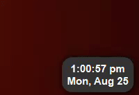
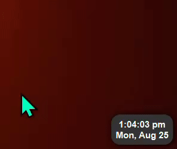
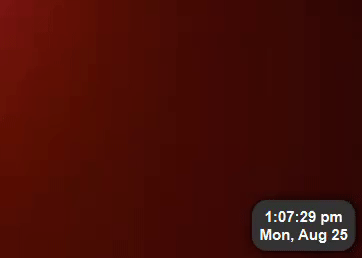

# Actually Good Overlay Clock
## (A.G.O.C.)
[Advanced ReadMe](https://github.com/FractalScripts/actually-good-overlay-clock/blob/main/README_ADVANCED.md)

---
### A lightweight clock that displays over your screen with much thought put into it.

---
## What is this?
AGOC is an <ins>extremely customizable</ins> desktop clock that displays over your other windows

Useful for people who have auto-hiding taskbars (Very common on laptops) but you still want to see the time!

Includes smart handling of the mouse so you can still interact with elements under the clock, so you never give up valuable screen real estate!

  

### Customization
The customization file is accessible though the tray menu.

You can customize its appearance down to the shadows and corner radius, change the layout of the text, and even change its behaviour, letting it also hide when your mouse is at the bottom of your screen. (Useful for auto-hiding taskbars, as the taskbar doesnt always stay on top of the clock.)

**Visual Studio Code is highly recommended for modifying the config file as it increases visibility, but it is not required.**

---
## Features:
- Changing the text layout for a truely unique look
  - (Refer to these [time and date formats](https://github.com/FractalScripts/actually-good-overlay-clock/blob/main/README_ADVANCED.md#time-and-date-format).)
- Text fonts, size, and even style
- Change the color of anything that has color
- Custom position on the screen
  - Supports centered positions
- Transparency and mouse detection
- Customize the look of the window down to the shadow
- Always on top and Click-through
- Visibility toggle
- Custom tray icon and tooltip
- Icon inversion, for all the dark mode users!
- Many different pre-loaded icons for you to choose from!

---
### Why did I make this?
I decided to create this application to fill a void in the available apps today: A well thought out overlay clock that doesn't hog your screen space, your CPU, or your sanity.
Previous apps I've used were all either not adaptable enough, too buggy, or just kinda ugly.
This aims to fill that void, with fully configurable appearances and running on under 300\* lines of code.
I've worked on this for **2 entire days**\*\*, and I had just begun to lose my sanity after I finished it.
###### \*The main Python file (pre-compiled) has just under 300 lines of code, as of v1.0.
###### \*\*Work time for v1.0 was about 2 days, including nighttime. (About 24h or so)

---
## How to install (or more accurately, not install.)
###### It's a portable. Please get the joke.

- Go to the [latest releases](https://github.com/FractalScripts/actually-good-overlay-clock/releases)
- Download `AGOC.zip`
- Extract the zip to wherever you want
- Run `AGOC.exe`
  - Windows SmartScreen might pop up warning you of the program. This is because AGOC is <ins>unsigned software</ins>. This is completely normal and as long as you are downloading the app from the [official GitHub repository](https://github.com/FractalScripts/actually-good-overlay-clock), it is completely safe.
  - To bypass Windows SmartScreen, click <ins>More info</ins> and <ins>Run anyway</ins>.
- There will be a tray icon that could be hidden. You can exit the app there.
- The configuration file (`config.py`) is located in the same folder as the executable.
- Refer to `timeFormat.txt` for the time syntax.

---
### [Custom Icons](https://github.com/FractalScripts/actually-good-overlay-clock/blob/main/README_ADVANCED.md#custom-icons)

### [How to make AGOC run on startup](https://github.com/FractalScripts/actually-good-overlay-clock/blob/main/README_ADVANCED.md#how-to-make-agoc-run-on-startup)

### [Time and Date format](https://github.com/FractalScripts/actually-good-overlay-clock/blob/main/README_ADVANCED.md#time-and-date-format)

---
---
---
**This is open-source software.**

You can view and edit the source code for your own private uses.

You may modify it and redistribute it for free so long as you give credit and link back to [this page](https://github.com/FractalScripts/actually-good-overlay-clock).

You may **not** redistribute this software as your own and/or sell it for currency.

This software should remain free and open for all.

You may use this software for content so long as you give credit and link back to [this page](https://github.com/FractalScripts/actually-good-overlay-clock).

You may not use this software for any malicious intents or purposes.

---
###### © Copyright 2025, FractalScripts
